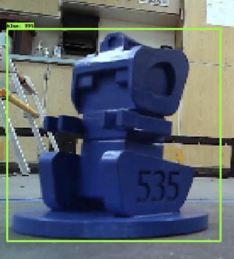
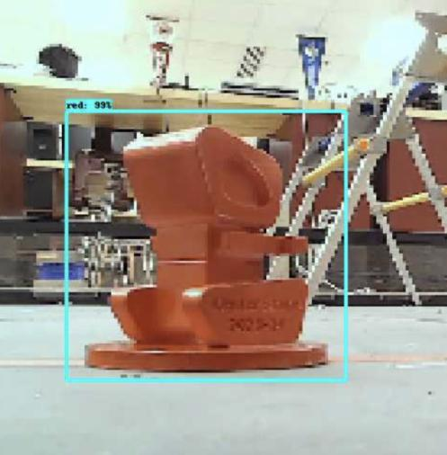

# 2023-2024 Season Team Code
535 Tobor's team code has all new updates and revisions with the new sliced-up version.

## What's new?

### Enums

Enums were added to the code in this slice to improve organization.
 
Bellow is an example of an enum file and how it is used in this version:

<pre>
package org.firstinspires.ftc.teamcode.operations;

public enum DeviceNames {
    DEFAULT_IMU("imu"),
    DEFAULT_CAMERA("Webcam 1");

    private final String name;

    DeviceNames(final String name) {this.name = name;}

    public String hardwareMapName() {
        return name;
    }
}
</pre>

Here is how the enum names are used:

<pre>
imuGet(hardwareMap, DeviceNames.DEFAULT_IMU.hardwareMapName(), "LEFT", "UP");
initAprilTag(hardwareMap, DeviceNames.DEFAULT_CAMERA.hardwareMapName());
</pre>

Enums are not always essential in Java programming, but they can be very useful for organizing values in your code. They are particularly helpful when dealing with long and complex words that are difficult to spell. In addition, using enums can help you avoid spelling mistakes while working in Android Studio.

### Tensor Flow

This version of team code is the start to using tensor flow. This version contains tensor flow models and starts to add them to the code. Bellow is some images of the training models:

